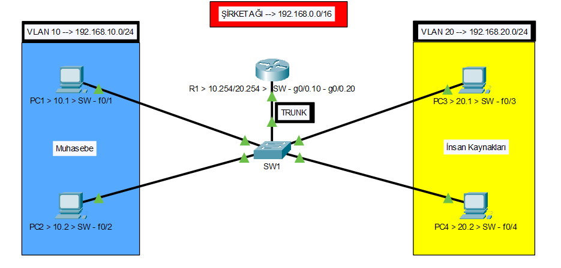

🛡️ VLAN Segmentasyonu ve Inter-VLAN Yönlendirme

Bu proje, orta ölçekli bir kurumsal ağ altyapısında ISO/OSI Referans Modeli'nin 2. ve 3. katmanlarında hiyerarşik ve güvenli bir yapının nasıl inşa edileceğini adım adım simüle eder. Projenin temel odağı, siber güvenliğin yapı taşı olan "Ağ Segmentasyonu" (Network Segmentation) mimarisini hayata geçirerek saldırı yüzeyini daraltmaktır.

🏗️ Proje Mimarisi ve Tasarım Prensipleri

Proje, kurumsal hiyerarşiye uygun olarak Muhasebe (VLAN 10) ve İnsan Kaynakları (VLAN 20) departmanlarını fiziksel olarak aynı anahtarlama (Switch) donanımını paylaşmasına rağmen, mantıksal olarak tamamen farklı yayın (Broadcast) etki alanlarına bölmektedir.

    Şirket Üst Bloğu: 192.168.0.0/16.

    VLAN 10 (Muhasebe): 192.168.10.0/24 - Kritik finansal verilerin izolasyonu.

    VLAN 20 (İnsan Kaynakları): 192.168.20.0/24 - Personel verilerinin güvenliği.

🛠️ Teknik Uygulama ve Konfigürasyon Adımları

1. Katman 2: VLAN Segmentasyonu ve Access Port Yapılandırması

Switch üzerindeki her bir fiziksel port, ilgili departmanın VLAN'ına hapsedilerek switchport mode access komutuyla yapılandırılmıştır. Bu işlem, Layer 2 seviyesinde tam izolasyon sağlar.
Bash

# VLAN Tanımlamaları
Switch(config)# vlan 10
Switch(config-vlan)# name Muhasebe
Switch(config)# vlan 20
Switch(config-vlan)# name Insan_Kaynaklari

# Port-VLAN Eşleşmesi (Access Mode)
Switch(config)# interface range f0/1 - 2
Switch(config-if-range)# switchport mode access
Switch(config-if-range)# switchport access vlan 10

Switch(config)# interface range f0/3 - 4
Switch(config-if-range)# switchport mode access
Switch(config-if-range)# switchport access vlan 20

2. Katman 2: IEEE 802.1Q Trunking (Veri Otoyolu)

Switch ve Router arasındaki hat, tüm VLAN trafiklerinin taşınabilmesi için Trunk moda alınmıştır. Paketler bu hat üzerinden geçerken 802.1Q standardına göre etiketlenir (Tagging).
Bash

Switch(config)# interface gig0/1
Switch(config-if)# switchport mode trunk

3. Katman 3: Router-on-a-Stick (Sub-Interfaces)

Cisco 2911 Router üzerinde, fiziksel port mantıksal alt arayüzlere bölünerek her bir VLAN için bir Default Gateway tanımlanmıştır.
Bash

Router(config)# interface gig0/0
Router(config-if)# no shutdown

# Sub-interface Yapılandırması ve Dot1Q Kapsülleme
Router(config-if)# interface gig0/0.10
Router(config-subif)# encapsulation dot1Q 10
Router(config-subif)# ip address 192.168.10.254 255.255.255.0

Router(config-if)# interface gig0/0.20
Router(config-subif)# encapsulation dot1Q 20
Router(config-subif)# ip address 192.168.20.254 255.255.255.0

🧪 Doğrulama ve Test Metodolojisi

Sistemin kararlılığı aşağıdaki CLI komutları ve testlerle teyit edilmiştir:

    show vlan brief: Port-VLAN atamalarının doğrulanması.

    show ip route: Router'ın her iki alt ağı da doğrudan bağlı (Connected) olarak yönlendirme tablosuna eklediğinin kanıtı.

    ICMP Ping Testi: Farklı VLAN'lardaki cihazların Router üzerinden kurduğu kontrollü iletişimin doğrulanması.

Bu proje, bir ağın sadece çalışmasını değil, aynı zamanda güvenli bir mimari üzerine inşa edilmesini temel alır.
